# 🐦‍🔥🐦‍🔥 # Arduino Automatic Braking System

  

An intelligent automatic braking system using Arduino that adjusts motor speed based on ultrasonic distance measurements to prevent collisions.

## Features

- **Distance Sensing**
  - HC-SR04 Ultrasonic sensor for accurate distance measurement (up to 400cm)
  - Averaged readings for stable measurements
  - Real-time distance display on LCD and Serial Monitor

- **Motor Control**
  - Three-speed control based on obstacle distance:
    - Full speed (255) when >100cm
    - Reduced speed (100) when 50-100cm
    - Complete stop when ≤50cm
  - L298N motor driver compatible

- **Visual Feedback**
  - 16x2 I2C LCD display showing distance and status
  - LED indicator for close obstacles (<100cm)
  - Serial monitor output for debugging

## Hardware Components

1. Arduino Uno/Nano
2. HC-SR04 Ultrasonic Sensor
3. L298N Motor Driver
4. 16x2 I2C LCD Display
5. DC Motor (24V, 0.5A as per diagram)
6. LED for status indication
7. Power supply (24V for motor, 5V/9V for Arduino)

## Circuit Diagram

)

Key Connections:
- Ultrasonic: Trig(2), Echo(3)
- Motor Driver: enA(9), in1(8), in2(7)
- LCD: I2C (SDA-A4, SCL-A5)
- LED: Pin 4

## Installation

1. **Hardware Setup**
   - Connect components as shown in circuit diagram
   - Ensure proper power supply to motor and Arduino

2. **Software Setup**
   - Install required libraries:
     ```bash
     # LiquidCrystal_I2C library for LCD
     # Available in Arduino Library Manager
     ```
   - Upload the provided code to Arduino

3. **Calibration**
   - Adjust distance thresholds in code if needed:
     ```cpp
     // Distance thresholds
     if (distance <= 50) { ... }
     else if (distance > 50 && distance <= 100) { ... }
     else { ... }
     ```
   - Modify motor speed values as required

## Usage

1. Power on the system
2. LCD will display "Smart Stop Ready" during initialization
3. System will automatically:
   - Measure distance to obstacles
   - Display distance on LCD
   - Adjust motor speed based on distance
   - Light LED when obstacle is within 100cm
   - Stop motor when obstacle is within 50cm

## Code Overview

```mermaid
flowchart TD
    A[Start] --> B[Initialize Components]
    B --> C[Measure Distance]
    C --> D{Obstacle Distance}
    D -->|≤50cm| E[Stop Motor]
    D -->|50-100cm| F[Reduce Speed]
    D -->|>100cm| G[Full Speed]
    E --> C
    F --> C
    G --> C
```



Key Functions:
- `getAverageDistance()`: Takes multiple ultrasonic readings for stability
- Motor control logic adjusts speed based on three distance thresholds
- LCD and Serial output for monitoring

## Customization

1. Adjust distance thresholds in the `loop()` function
2. Change motor speed values (0-255 range)
3. Modify LED activation distance (currently 100cm)
4. Add buzzer for audible alerts

## Troubleshooting

- **Inconsistent distance readings**: Ensure ultrasonic sensor is properly connected and facing forward
- **Motor not responding**: Check motor driver connections and power supply
- **LCD not displaying**: Verify I2C address (try 0x27 or 0x3F)

## License

MIT License - Free for personal and educational use

## Future Enhancements

- Add manual override switch
- Implement speed control via potentiometer
- Add data logging capability
- Wireless monitoring via Bluetooth/WiFi

For questions or contributions, please open an issue on GitHub.

🤝 **Connect with Me**

Have questions about this project, or are you working on your own exciting Arduino endeavors? Feel free to connect or DM me on LinkedIn! 
I'm always happy to discuss embedded systems, IoT, and innovative tech solutions.

Name - [Muhammad Taha](https://twitter.com/yourtwitter) - toaha155@gmail.com

Linkedin: [https://www.linkedin.com/in/muhammad-taha101/](https://www.linkedin.com/in/muhammad-taha101/)
